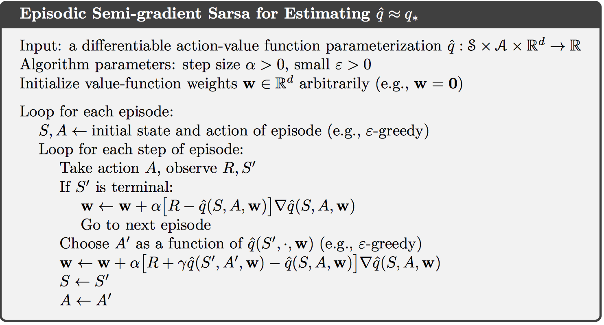
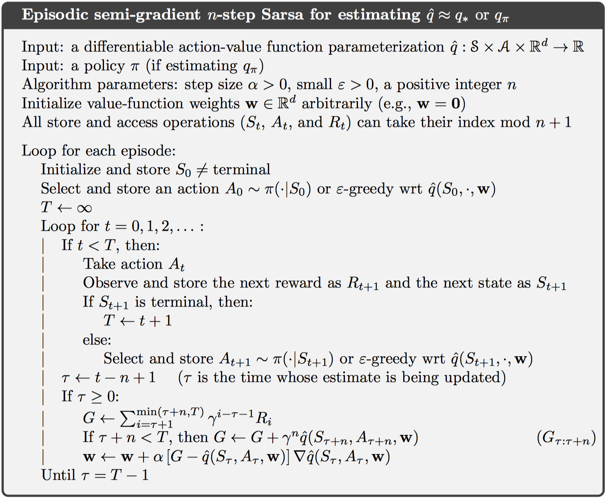
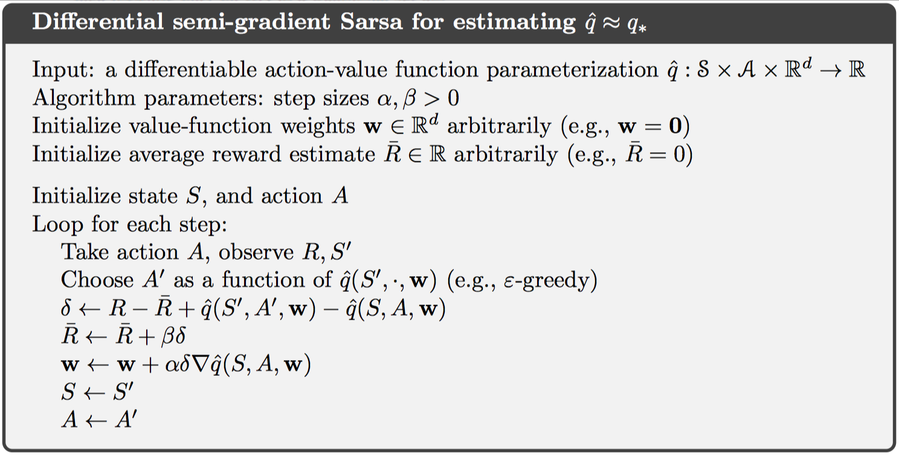
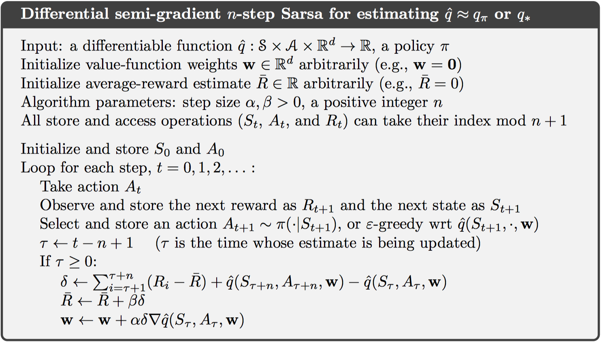

# Chapter 10 On-policy Control with Approximation

这一章主要介绍一些在线策略的近似控制方法，对于片段式任务，可以直接应用之前的方法。而对于连续式任务，则需要引入一些新的技巧，并且之前的折扣奖励机制不再需要。

## 10.1 Episodic Semi-gradient Control

如果动作空间是离散的、有限的，则直接之间按照上一章的方法计算动作值函数$\hat { q } \left( S _ { t } , a , \mathbf { w } _ { t } \right)$，然后定义最优动作$A _ { t } ^ { * } = \arg \max _ { a } \hat { q } \left( S _ { t } , a , \mathbf { w } _ { t } \right)$。之后使用软策略实现策略提升过程，如$\epsilon-greedy$，如下所示：

## 10.2 Semi-gradient n-step Sarsa

对于n-step sarsa，使用同样的方法。其中，权重更新公式如下：
$$
\mathbf { w } _ { t + n } \doteq \mathbf { w } _ { t + n - 1 } + \alpha \left[ G _ { t : t + n } - \hat { q } \left( S _ { t } , A _ { t } , \mathbf { w } _ { t + n - 1 } \right) \right] \nabla \hat { q } \left( S _ { t } , A _ { t } , \mathbf { w } _ { t + n - 1 } \right)
$$
伪代码如下：

很多情况下，设置大于1的中间自引导步数可以得到最好的结果。

## 10.3 Average Reward: A New Problem Setting for Continuing Tasks

前面所介绍的都是对于片段式任务而言，并且使用折扣奖励机制。这一节主要针对连续式任务，并引入均值奖励设置，定义如下：
$$
\left.\begin{aligned} r ( \pi ) & \doteq \lim _ { h \rightarrow \infty } \frac { 1 } { h } \sum _ { t = 1 } ^ { h } \mathbb { E } \left[ R _ { t } | A _ { 0 : t - 1 } \sim \pi \right] \\ & = \lim _ { t \rightarrow \infty } \mathbb { E } \left[ R _ { t } | A _ { 0 : t - 1 } \sim \pi \right] \\ & = \sum _ { s } \mu _ { \pi } ( s ) \sum _ { a } \pi ( a | s ) \sum _ { s ^ { \prime } , r } p \left( s ^ { \prime } , r | s , a \right) r \end{aligned} \right.
$$
其中，$\mu_{\pi}$是一个固定的分布，可以定义为$\mu _ { \pi } ( s ) \doteq \lim _ { t \rightarrow \infty } \operatorname { Pr } \{ S _ { t } = s| A _ { 0 : t - 1 } \sim \pi \}$，这种假设称为**遍历**，这意味着MDP的起始状态或者任何早期决定都只具有有限的影响，在长期运行中，期望值只受转移概率和策略的影响。

因此，在连续式任务中，均值奖励最大的策略是最优策略。注意到状态的分布是不变的，因此存在以下公式：
$$
\sum _ { s } \mu _ { \pi } ( s ) \sum _ { a } \pi ( a | s ) p \left( s ^ { \prime } | s , a \right) = \mu _ { \pi } \left( s ^ { \prime } \right)
$$
返回值则被定义为均值奖励的差值，如下：
$$
G _ { t } \doteq R _ { t + 1 } - r ( \pi ) + R _ { t + 2 } - r ( \pi ) + R _ { t + 3 } - r ( \pi ) + \cdots
$$
这也被称为差值奖励，此外，还存在差值值函数，差值贝尔曼方程等。差值TD error定义如下：
$$
\left. \begin{array} { l } { \delta _ { t } \doteq R _ { t + 1 } - \overline { R } _ { t + 1 } + \hat { v } \left( S _ { t + 1 } , \mathbf { w } _ { t } \right) - \hat { v } \left( S _ { t } , \mathbf { w } _ { t } \right) } \\  { \delta _ { t } \doteq R _ { t + 1 } - \overline { R } _ { t + 1 } + \hat { q } \left( S _ { t + 1 } , A _ { t + 1 } , \mathbf { w } _ { t } \right) - \hat { q } \left( S _ { t } , A _ { t } , \mathbf { w } _ { t } \right) } \end{array} \right.
$$
这样一来，权重更新可以与上一张采用相同的方式，如下：
$$
\mathbf { w } _ { t + 1 } \doteq \mathbf { w } _ { t } + \alpha \delta _ { t } \nabla \hat { q } \left( S _ { t } , A _ { t } , \mathbf { w } _ { t } \right)
$$

## 10.4 Deprecating the Discounted Setting

在近似强化学习中，折扣奖励机制没有任何作用。

考虑一个无限的返回值序列，所有状态相同，假设均值奖励为$r(\pi)$，则折扣奖励的权重为$1 + \gamma + \gamma ^ { 2 } + \gamma ^ { 3 } + \cdots = 1 / ( 1 - \gamma )$，即$r ( \pi ) / ( 1 - \gamma )$，可以看到，折扣值对于最终的计算没有任何影响。

根本原因在于，在近似函数逼近中，当改变策略来提升某个状态的折扣奖励值时，全局策略不一定保证提升。即4.2节中的策略提升定义失效。

## 10.5 Differential Semi-gradient n-step Sarsa

连续式任务仍然可以使用n-step自引导控制方法，定义差值返回值如下：
$$
G _ { t : t + n } \doteq R _ { t + 1 } - \overline { R } _ { t + 1 } + R _ { t + 2 } - \overline { R } _ { t + 2 } + \cdots + R _ { t + n } - \overline { R } _ { t + n } + \hat { q } \left( S _ { t + n } , A _ { t + n } , \mathbf { w } _ { t + n - 1 } \right)
$$
则n-step td error为：
$$
\delta _ { t } \doteq G _ { t : t + n } - \hat { q } \left( S _ { t } , A _ { t } , \mathbf { w } \right)
$$
伪代码如下：

## 10.6 Summary

这一章中将参数化函数逼近的方法和半梯度下降的方法，应用在线策略的强化学习控制方法中，包括连续式任务和片段式任务。对于连续式任务，由于在函数逼近方法中不能使用折扣奖励机制，故而提出均值奖励设置，并引入差值形式的各种值函数、贝尔曼方程和TD误差。