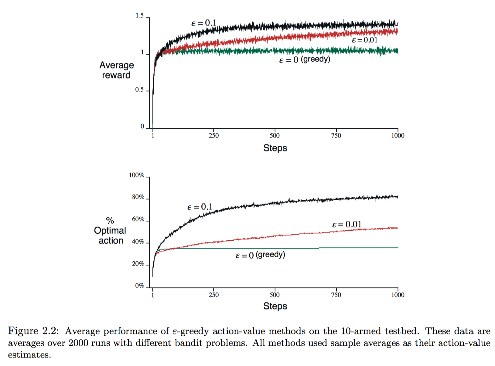
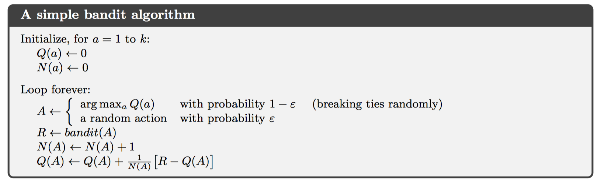
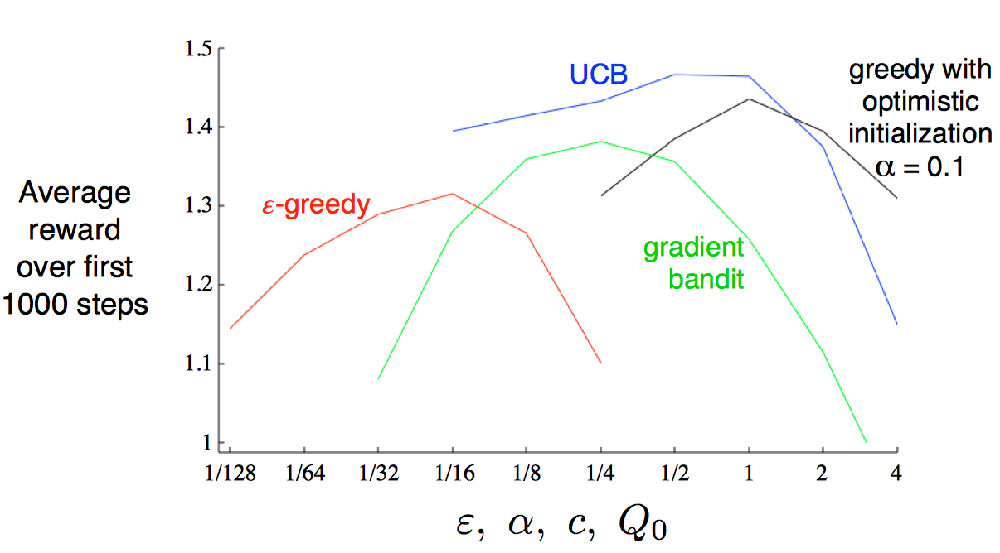

# Chapter 2: Multi-armed Bandits（多臂赌博机）

强化学习和其他形式的学习最大的区别在于，强化学习以评价当前动作为训练信息，而不是依靠给定正确的动作作为训练信息。

这一章介绍的是最简单的强化学习问题，使用不相关假设，即只在一种情况下学习，外界环境不变。

## 2.1 A k-armed Bandit Problem（k臂赌博机问题）

定义：当你面临k个不同的选择时，每次选择后，你都会以一定的概率分布获得奖励。你的目标是在一定的时间内，获得最多的总奖励。

定义一个值函数q*(a)，代表选择动作a所能得到奖励的期望。由于值函数是未知的，因此对值函数的估计为Qt(a)。在每一个时间t，都会对值函数的估计进行更新。

如果在每一个时刻都从Qt(a)中选择最优值，那就是一种贪婪策略。另外，每次选择最优值称作`exploiting`，选择非最优值称作`exploring`。这两种选择是矛盾的，不可同时采用，如何平衡这两种策略是下文所要介绍的方法。

## 2.2 Action-value Methods(动作-值方法)

首先，当然是要得到精确的动作值函数估计，最简单的方法就是平均到目前为止该动作所得到的奖励。

$$
Q _ { t } ( a ) \doteq \frac { \text{ sum of rewards when a taken prior to t } } { \text{ number of times a taken prior to t } }  =  \frac { \sum _ { i = 1} ^ { t - 1} R _ { i } \cdot I _ { A _ { i } } = a } { \sum _ { i = 1} ^ { t - 1} I _ { A _ { i } } = a }
$$

根据大数定理，随着已知奖励的增多，估计将会越来越精确。这也称作sample-average方法。

至于策略选择，可以使用$ \varepsilon - g r e e d y $的近似贪婪策略。即，每次以$ \varepsilon$的概率从**所有动作**中随机选择，以$ 1 - \varepsilon$的概率进行贪婪选择。

## 2.3 The 10-armed Testbed(10臂赌博机测试模板)

这节主要是实验对比greedy和$ \varepsilon - g r e e d y $策略的效果。10-armed testbed指的是10-armed问题，每一个动作的奖励来源于均值为q*(At)，方差为1的正态分布；而q*(a)值函数来源于均值0方差1的正态分布。

实验中，短期看greedy策略增长迅速，但长期看$ \varepsilon - g r e e d y $最终效果更好；且$ \varepsilon$越小，长期效果越好。故而，随着时间增长，减小$ \varepsilon$可以得到更好的效果。

## 2.4 Incremental Implementation(增量实现)

之前的方法都是使用sample averages估计奖励，为了减少计算量，提出增量式均值计算方法。

$$
Q_{n+1} = Q _ { n } + \frac { 1} { n } \left[ R _ { n } - Q _ { n } \right]
$$

如果把上述中增量实现均值的公式抽象化，得到如下：

$$
\text{ New Estimate } \leftarrow \text{ OldEstimate } + \text{ StepSize } [ \text{ Target } - \text{ Old Etimate } ]
$$

其中，$[ \text{ Target } - \text{ Old Etimate } ]$可以看做误差项error，并以StepSize参数放缩。

## 2.5 Tracking a Nonstationary Problem(处理非稳定问题)

稳定问题：每一个动作的奖励函数来源一个固定的概率分布，不变化。
不稳定：每一个动作的奖励的概率分布是变化的。

对待不稳定的赌博机问题，需要设置最近出现的奖励权重更大，而更早以前的奖励权重跟小。最简单就是使用固定的stepsize，即**指数加权平均**的方法。

$$
\left.\begin{aligned} Q _ { n + 1} & = Q _ { n } + \alpha \left[ R _ { n } - Q _ { n } \right] \\ & = \alpha R _ { n } + ( 1- \alpha ) Q _ { n } \end{aligned} \right.
$$

根据随机逼近理论，要求第一个条件要求保证步数足够大，以最终克服初始条件变化或随机波动，第二个条件保证最终步长变小，以保证收敛。对于sample-average情况，步长=1/n，满足这两个条件；而固定步长很显然不满足第二个条件，故而无法收敛，而会根据最近的奖励持续变化，这也是用于解决不稳定问题。

## 2.6 Optimistic Initial Values(乐观初始值)

所有上述方法都会因初始值不同而产生误差bias，对于sample average方法来说，如果所有动作至少选择一次，可以消除初始值误差影响；但对于指数加权平均的方法来说，误差永远存在，但会随着时间的增加而削弱。

这种设置初始值的方法可以用来鼓励explore，例如，所有动作初始化全部设置为+5，即一个比较大的奖励，那么即使是贪婪策略，系统也会多次选择到这个大的奖励，相当于explore的过程。

但这种方法并不适用于非稳定的问题。

## 2.7 Upper-Confidence-Bound Action Selection(置信上限动作选择)

在explore过程中，即使是$ \varepsilon - g r e e d y $贪婪策略，explore仍然会随机选择一个动作。更好的做法是从非贪婪动作中选择那些最有可能成为最优奖励的动作，故而需要同时对动作的估计值和动作估计值的不确定性建模，如下：

$$
A _ { t } \doteq \arg \max _ { a } \left[ Q _ { t } ( a ) + c \sqrt { \frac { \ln t } { N _ { t } ( a ) } } \right]
$$

这也成为置信上限动作选择，上述需要max的值也就是动作a可能真实奖励的上限，c称作置信度。随着时间t的增加，不确定性会增大，但受log约束，增幅比较小；随着选择a次数的增加，不确定性会减小。

在处理非确定性问题和大状态空间时，这种方法并不实用。

## 2.8 Gradient Bandit Algorithms(梯度赌博算法)

对每一个动作计算一个重要度Ht(a)，使用softmax表示为概率。这个值和奖励并无直接可解释的关系。

训练使用随机梯度下降法：

$$
\left.\begin{array} { r l } { H _ { t + 1} \left( A _ { t } \right) } & { \doteq H _ { t } \left( A _ { t } \right) + \alpha \left( R _ { t } - \overline { R } _ { t } \right) \left( 1- \pi _ { t } \left( A _ { t } \right) \right) ,} & { \text{ and } } \\ { H _ { t + 1} ( a ) } & { \doteq H _ { t } ( a ) - \alpha \left( R _ { t } - \overline { R } _ { t } \right) \pi _ { t } ( a ) ,} & { \text{ for all } a \neq A _ { t } } \end{array} \right.
$$

其中，均值可以使用之前的增量方式计算，这个均值代表当前的baseline，即所有收到的奖励均值；也可以将这个baseline设置为一个固定值。值得注意的是，这个baseline值只会影响更新的方差和收敛速度。*（貌似和学习速率的功能很相似）*

实际上，上面的更新公式完全是由梯度下降算法推导而来，损失函数取的是负奖励函数。
$$
H _ { t + 1} ( a ) \doteq H _ { t } ( a ) + \alpha \frac { \partial \mathbb { E } \left[ R _ { t } \right] } { \partial H _ { t } ( a ) }
\\
\mathbb { E } \left[ R _ { t } \right] = \sum _ { x } \pi _ { t } ( x ) q _ { * } ( x )
$$

## 2.9 Associative Search(关联搜索)

实际中不只有稳定问题、不稳定问题，还有关联任务、不关联任务。通用的强化学习任务中，往往需要学习一种策略，即应对不同的环境情况，选择不同的动作。例如，每一时刻都会随机从若干个k臂赌博机中选择一个作为当前环境。它与不稳定问题的区别在于，不稳定问题每一时刻同一动作选择的奖励分布变化很小，而关联任务中，同一动作对应不同赌博机的概率分布变化会很大。

关联搜索任务也称作上下文赌博机，它介于k-臂赌博机和全强化学习问题之间，如果允许当前动作不仅影响当前奖励，也影响下一个环境，那么就变成了完全强化学习问题。

## 2.10 Summary

这一章主要介绍了一些平衡expore和exploit的方法，如greddy，$ \varepsilon - g r e e d y $，UCB，Gradient Bandit等。

通过绘制parameter-study图，可以看到，不同算法的学习曲线都是呈倒U状，存在一个极值；如果只去比较他们的极值的话，UCB方法似乎最好的。

实际上，除了这些简单的方法，还有更复杂的，但我们的实际要解决的是完全强化学习问题，情况更复杂，复杂方法可能难以实现，这些简单的方法已经可以达到很好的效果了。

然而，还有一些方便学习的算法，如Gittins指数，Bayesian方法等；这两个方法都需要已知问题的先验分布。