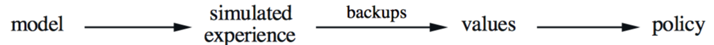
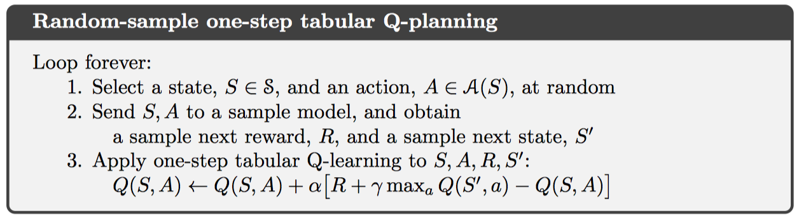
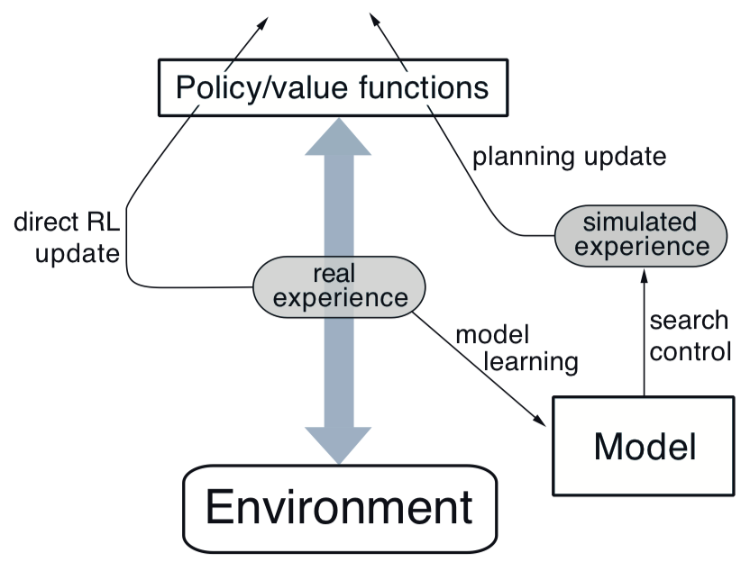
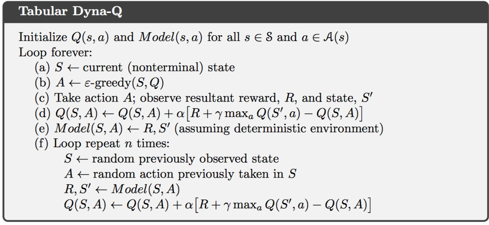
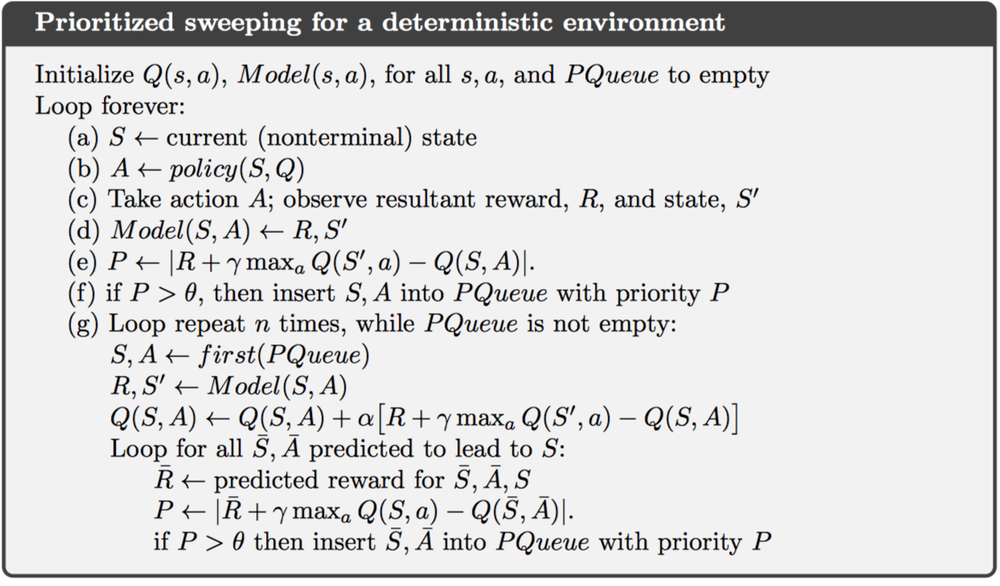
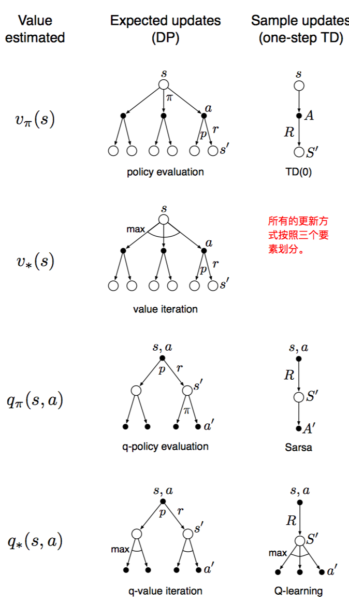
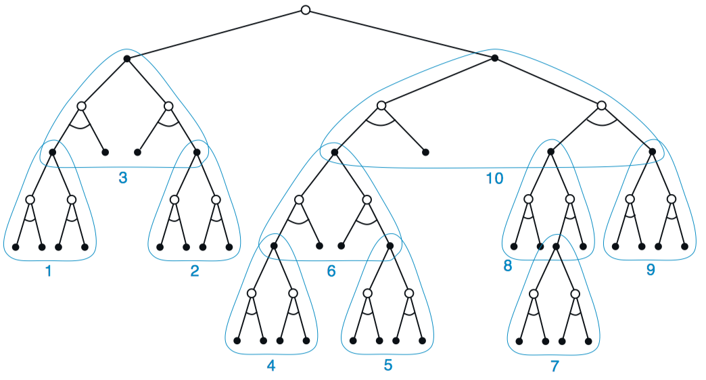
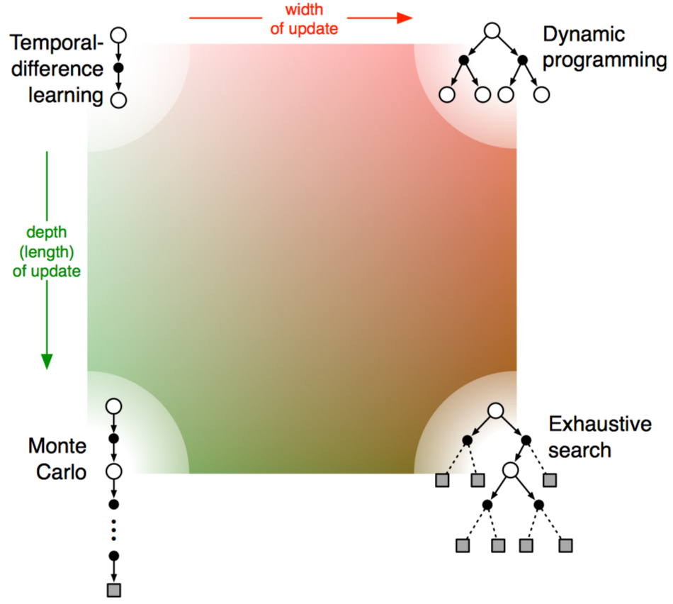

# Chapter 8 Planning and Learning with Tabular Methods

之前的章节中学习了基于模型的方法（model-based）和模型无关的方法（model-free）。基于模型的方法使用planning方式，而模型无关的方法使用learning的方式。这一章中试图将这两种方法整合起来。

## 8.1 Models and Planning

model：

- distribution model（分布式模型）
- sample model（采样模型）

experience：

- real experience（真实经验）：从真实模型产生
- simulated experience（模拟经验）：从学习到的模型产生

planning：

- state-space planning（状态空间搜索）
- plan-space planning（规划空间搜索）

其中，状态空间搜索使用如下方式，前面的动态规划方式就是一种状态空间搜索：

其实，planning与learning的区别仅在于，planning使用模型经验，learning使用真实经验。一个用于planning的q-learning算法，random-sample one-step tabular Q-planning，如下所示：

## 8.2 Dyna: Integrated Planning, Acting, and Learning

从真实经验直接学习策略称作direct RL，从真实经验学习模型，再通过模型规划策略，称作indirect RL。间接学习的方式充分利用了实际经验，得到的策略更精确；而直接学习的方式更加简单，不受学习模型误差影响。结合直接学习和间接学习的方法称作Dyna-Q方法。

在Dyna-Q中，planning方法使用random-sample one-step tabular q-planning，直接学习采用one-step tabular q-learning，模型学习使用基于表格的方法，并且假设环境是固定的。一般来说，这几个过程是可以并行进行的。一种通过的架构如下：

## 8.3 When the Model Is Wrong

当环境是动态变化的，模型学习过程可能并不精确。因为只观测到了少量采样样本，并且已经过期，这样只会学习到次优策略。因此需要考虑的仍然是平衡exploration和exploitation，使得agent可以适应环境的变化。一般而言，这种平衡过程无法达到两个最优，但是简单的启发式过程已经可以十分有效。

改进后的Dyna-Q方法称作Dyna-Q+。经历的时间的越长，样本越容易发生改变，模型越容易出错。因此，在模拟经验中引入“bonus reward”，每一个动作转移产生的奖励为$r + \kappa \sqrt { \tau }$，其中，$\tau$为这个转移被忽略的时间长度。这种方式可以通过鼓励探索的方式修正学习模型的偏差。

## 8.4 Prioritized Sweeping

在Dyna算法中，planning使用随机uniform采样的方式，效率较低；使用优先级扫描（prioritized sweeping）可以只关注一部分特殊的状态-动作对。

这里使用一种方向传播算法，称作“backward focusing”，即首先更新那些需要紧急更新的状态值函数，并且进行回退，即如果子节点发生变化，父节点也会发生变化。这里的紧急度（urgency）使用TD error来衡量。

优先扫描算法：维护每个状态 - 动作对的优先级队列，按照估计值变化的大小排列，每次取出变化最大的状态-动作对进行更新，进一步将其每个前任加入队列，并计算估计值变化。

优先扫描的一种扩展形式：模型学习过程中保存所有状态-动作对及其被访问过的次数；在更新值函数过程中，使用expected update，而不是sample update。

优先扫描虽然提高了planning的效率，但仍然具有局限性，即在随机环境的情况下，使用期望更新的方式可能会浪费很多计算资源在小概率转移上。实际上，还有跟多策略可以选择，如“forward focusing”等。

## 8.5 Expected vs. Sample Updates

目前所学到的很多值函数更新方式都可以按照以下三个维度分类：1. 状态值函数or动作值函数；2. 最优策略or给定策略； 3. 期望更新or采样更新。如下图所示：

期望更新和采样更新的主要区别在于环境是随机的情况下。期望更新计算更加精确；而采样更新会受到误差影响。另一方面，采样更新计算更加简单。一般而言，有足够时间的情况下，推荐期望更新；时间不充裕的情况下，推荐采样更新。即采样更新适用于下一个状态随机变化较大，或者有很多状态需要解决的情况。

## 8.6 Trajectory Sampling

这一节主要比较两种分布式更新方式，一种是传统的动态规划，即每次扫描中更新所有状态值函数。另一种是基于某种分布从状态空间中选取状态值函数进行更新。

这种分布可以使Dyna-Q中的uniform分布，不过这就和动态规划中的完全扫描没有什么区别了。一般是基于某个策略而观测到的采样分布，简单可行。这种方式也称作轨迹采样（trajectory sampling）。

基于在线策略采样得到的分布，在初期更新更快得到更好的效果；但长期的时候，因为受到误差的影响，较uniform的效果会有所减弱。一般而言，推荐使用在线策略的分布，更适合大型问题。

## 8.7 Real-time Dynamic Programming

实时动态规划（RTDP）是一种基于在线策略轨迹采样的动态规划值迭代算法。其也是一种异步DP算法。

最终得到的是最优部分策略（optimal partial policy），即对于相关状态的最优策略，但无关状态的动作选择是未定义的或者随机的。并且，RTDP保证收敛到最优部分策略，不需要对每个状态访问无限次，甚至某些状态从来没有访问过。这种方式适用于状态数量较大的情况。

还有一些扩展情况，如用于stochastic optimal path problems的“learning real-time A*”算法。

RTDP另一个优点：其值函数达到最优值函数，并且其用于生成轨迹采样的策略也是最优策略。因为这个策略对于当前值函数而言总是最优的，并且最优策略可能在值函数并不是最优的时候提前形成。在传统DP中检查策略是否最优是一个额外的工作。

随着学习的继续，RTDP的关注范围越来越窄，最终只会关注那些最优策略上的状态。

## 8.8 Planning at Decision Time

planning包括两种方式，一种是之前的动态规划，Dyna等算法中提到的，利用模型从模拟经验中获得最优策略。即不断从表格中更新值函数，或者从很多状态中，选择最优动作，称作backward planning。

另一种为decision-time planning，即遇到每一个新状态，再去进行planning过程，即比较所有动作后下一个状态值函数的大小。

backward planning无法关注到当前状态，而decision-time planning关注于当前的具体状态。一般情况下，decision-time planning在每次选择具体动作后，都会将创建的值函数丢弃，这并不会带来十分大的损失，因为状态空间可能十分大。决策时规划通常用于不需要快速响应的系统。

## 8.9 Heuristic Search

启发式搜索是基于decision-time planning的一种状态空间规划算法。

对于当前状态S，从叶子节点的值函数反向传播到当前状态节点停止。经典的启发式搜索算法，并不改变值函数，而只寻找策略，因此，所有的值函数回退值被丢弃。

使用启发式搜索方式可以获得更好的策略。假设目前有准确的模型和不准确的价值函数，则使用更深的扫描，可以得到更好的策略。扫描深度为任务长度时， 策略最优。但扫描越深，消耗时间越长。因此，具体任务应该选择合适的深度。

启发式搜索只关注与当前状态相关的状态和动作，因此只需要更少的内存和计算资源。

除了策略选择，对于值函数更新可以选择类似的方式，即通过深度优先的启发式搜索方式，自底向上进行更新。这种更新方式并不在于将大量单个异步更新拼凑在一起，而是使得当前状态和子状态的更新更加集中。

## 8.10 Rollout Algorithms

rollout算法是基于MC控制的decision-time planning算法。该算法基于某个策略rollout policy，使用MC估计当前状态的动作值函数。注意在MC控制中估计完整的动作值函数。

具体实施中，对于当前状态的每个动作，计算返回值的均值，得到动作值函数的估计。取最大动作值函数所对应的动作作为当前状态的策略。这种方式一定会得到更优的策略。其也可以看做动作规划中的一步策略迭代算法。也就是说，rollout算法目的在于提升rollout策略，而不是找到最优策略。

但这种方式仍然会陷入平衡关系，好的rollout策略需要更多的模拟过程；但在decision-time planning中，时间限制往往十分严格。对此，有以下解决方案：1. 并行模拟多个试验；2. 将一个片段切分成很多短片段，对每个短片段返回值进行学习；3. 修剪掉那些不太可能是最优策略的候选动作。

该算法虽然不是学习算法，但应用到了强化学习的很多特性，如MC控制。

## 8.11 Monte Carlo Tree Search

蒙特卡洛树搜索是当前应用decision-time planning比较成功的一个案例。同样，在遇到每一个新状态时，MCTS被激活用于选择动作。

大多数情况下，用于生成模拟片段的策略称作rollout policy。任何模拟片段都会自顶向下穿过树，并从某个叶子节点退出。在树种的状态，使用tree policy选择动作，这部分时可以被优化的；而退出叶子节点后的动作选择使用默认的rollout policy。

其中，tree policy常常需要平衡探索和开采过程，一般使用$\epsilon-greedy$策略或者UCB规则。

具体而言，MCTS的每一个迭代包含以下步骤：

1. 选择：使用tree policy，选择从根节点到叶子节点的所有动作
2. 扩展：一些情况下，从叶子节点继续向下扩展一两个子节点，代表尚未被探索过的动作。
3. 模拟：从选择的叶子节点，或者被扩展的新节点开始，使用rollout policy完成一个完整的片段模拟。
4. 回退：计算模拟片段的返回值，并追层回退更新直到根节点。注意rollout policy选择的动作对应值函数并不被保存。

在重复迭代若干次后，从根节点开始，基于树种保存的数据使用某种策略选择每个动作，可能是最大值函数对应的动作，也可以是最大访问次数对应的动作。

MCTS实际是一种rollout算法，其基于在线学习，增量学习，采样学习的方式实现策略提升，此外，MCTS还将树内的动作值函数保存下来，并采样更新。

## 8.12 Summary of the Chapter

这一章结合了planning和learning的方法，提出了多种综合的强化学习方法。

此外，对于多种的state-space planning methods，可以划分为几个角度。一个维度是更新的大小变化，如sample update和expected update；另一个维度是更新的分布变化，如Prioritized sweeping关心值函数变化的状态，On-policy trajectory sampling关注更可能在实际环境中遇到的状态。

此外，planning还可以使用在更多的情况，如decision-time planning方式。

## 8.13 Summary of Part I: Dimensions

这一部分主要介绍了基于表格的多种强化学习方法，它们都有一些共同点：1. 估计值函数；2. 基于状态轨迹完成值函数回退更新；3. 遵循GPI策略。

此外，这些方法在以下几个维度上互相区分：1. 使用sample updates或者expected updates；2. 更新的深度，即自引导的度；3. on-policy还是off-policy策略。

