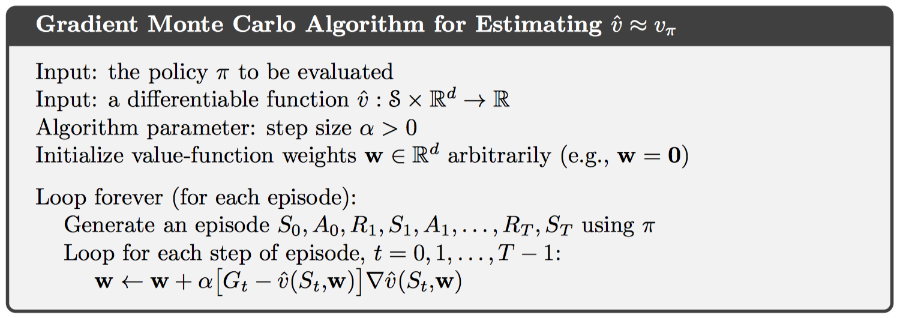
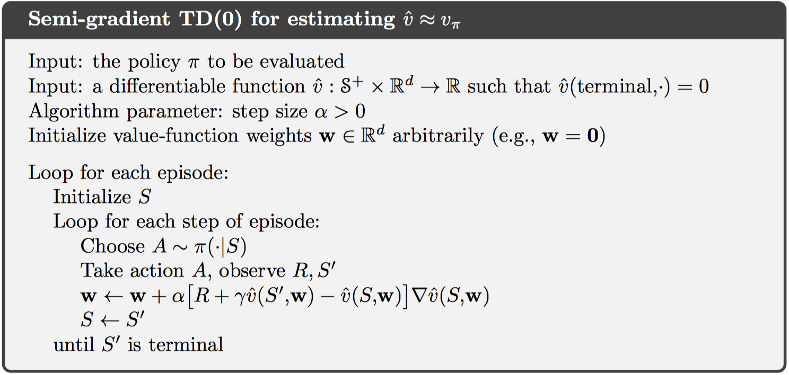
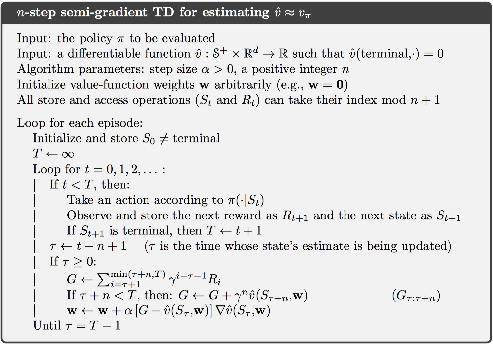

# Chapter 9 On-policy Prediction with Approximation

这一章提出参数化的值函数，写作$\hat { v } ( s , \mathbf { w } ) \approx v _ { \pi } ( s )$，其中参数大小远远小于状态空间大小，从而满足泛化要求。当改变某个状态的值函数时，其他状态的值函数可能也会随之变化。

然而，对于部分可观察的问题而言，函数逼近的方法不能使用过去观察到的记忆增加状态表示。

## 9.1 Value-function Approximation

前文中所有的预测方式都包含一个更新目标，如下：

MC：$S _ { t } \mapsto G _ { t }$

TD(0)：$S _ { t } \mapsto R _ { t + 1 } + \gamma \hat { v } \left( S _ { t + 1 } , \mathbf { w } _ { t } \right)$

N-step TD: $S _ { t } \mapsto G _ { t : t + n }$

DP: $s \mapsto \mathbb { E } _ { \pi } \left[ R _ { t + 1 } + \gamma \hat { v } \left( S _ { t + 1 } , \mathbf { w } _ { t } \right) | S _ { t } = s \right]$

将每一个状态更新看做是传统的训练样例，从而将值函数预测看做是监督学习的过程。

很多传统的监督学习方法都可以应用到强化学习中。然而，还需要满足以下两点：1. 能够实现增量学习；2. 可以处理不稳定目标函数

## 9.2 The Prediction Objective (VE)

在函数逼近方式中，一个状态更新可能会影响其他状态，因此无法满足所有状态都得到准确的值函数。这里定义均方误差如下：
$$
\overline { \mathrm { VE } } ( \mathbf { w } ) \doteq \sum _ { s \in \mathbb { S } } \mu ( s ) \left[ v _ { \pi } ( s ) - \hat { v } ( s , \mathbf { w } ) \right] ^ { 2 }
$$
其中，$\mu$为每一个状态的权重，即一个状态分布。通常使用on-policy分布，对于连续任务而言，在线分布就是某个策略下的固定分布。定义on-policy分布如下：
$$
\eta ( s ) = h ( s ) + \sum _ { \overline { s } } \eta ( \overline { s } ) \sum _ { a } \pi ( a | \overline { s } ) p ( s | \overline { s } , a ) , \text { for all } s \in \delta\\
\mu ( s ) = \frac { \eta ( s ) } { \sum _ { s ^ { \prime } } \eta \left( s ^ { \prime } \right) } , \quad \text { for all } s \in \delta
$$
其中，$\eta ( s )$为一个片段中某个状态s的平均访问次数，$h(s)$为一个片段中状态s开头的概率。

回想我们的终极目标是得到最优策略，但不一定满足均方误差最小。但目前并不清楚值函数预测的明确目标，我们只能专注于均方误差。

当然，对于最小化均方误差，我们希望寻找到全局最优值，但受限于复杂的值函数，一般只能寻找到局部最优值，这并不会影响很大，往往已经可以得到足够好的结果。

## 9.3 Stochastic-gradient and Semi-gradient Methods

对于学习值函数而言，大多基于随机梯度下降方式优化损失函数，即最小化均方误差，公式如下：
$$
\left.\begin{aligned} \mathbf { w } _ { t + 1 } & \doteq \mathbf { w } _ { t } - \frac { 1 } { 2 } \alpha \nabla \left[ v _ { \pi } \left( S _ { t } \right) - \hat { v } \left( S _ { t } , \mathbf { w } _ { t } \right) \right] ^ { 2 } \\ & = \mathbf { w } _ { t } + \alpha \left[ v _ { \pi } \left( S _ { t } \right) - \hat { v } \left( S _ { t } , \mathbf { w } _ { t } \right) \right] \nabla \hat { v } \left( S _ { t } , \mathbf { w } _ { t } \right) \end{aligned} \right.
$$
其中$\alpha$为学习率，随时间递减，从而保证收敛到局部最优。这主要受限于2.7节中的收敛条件。此外使用小的学习率是因为每次更新值并不一定准确，如自引导等方式。这里使用随机梯度下降也是如此，因为每次只使用一个样例进行更新。

一般而言，正确的值函数是未知的，故而使用如下更新公式：
$$
\mathbf { w } _ { t + 1 } \doteq \mathbf { w } _ { t } + \alpha \left[ U _ { t } - \hat { v } \left( S _ { t } , \mathbf { w } _ { t } \right) \right] \nabla \hat { v } \left( S _ { t } , \mathbf { w } _ { t } \right)
$$
如果$U_t$是值函数的无偏估计，即$\mathbb { E } \left[ U _ { t } | S _ { t } = s \right] = v _ { \pi } \left( S _ { t } \right)$，则可以保证收敛到局部最优值。

基于MC的SGD算法如下：

但是在自引导方式中，无法满足无偏估计这一要求，权值更新依赖于下一个状态的值函数。如果仍然使用原公式，不考虑下一个状态值函数的求导，则称为半梯度下降方式。这种方式在一些情况下仍然可以收敛，如线性拟合，并且这种方式允许快速计算，允许连续式任务和在线学习。

状态聚合，即将状态空间划分组，每个组使用一个估计值代表对应值函数。这也可以看做是SGD的一种特殊形式，即对于状态s所在组内的所有状态梯度值为1，而其他状态对应梯度为0。

## 9.4 Linear Methods

函数逼近的一个最常用的例子就是线性方法，公式如下：
$$
\hat { v } ( s , \mathbf { w } ) \doteq \mathbf { w } ^ { T } \mathbf { x } ( s ) \doteq \sum _ { i = 1 } ^ { d } w _ { i } x _ { i } ( s )
$$
其中，x为状态s的特征向量，或者称为基本函数（basic functions）。因此，构造d维特征向量的过程也是选择d个基本函数的过程。

结合上一节的SGD方法，更新权重如下：
$$
\mathbf { w } _ { t + 1 } \doteq \mathbf { w } _ { t } + \alpha \left[ U _ { t } - \hat { v } \left( S _ { t } , \mathbf { w } _ { t } \right) \right] \mathbf { x } \left( S _ { t } \right)
$$
在线性方法中，只存在一个最优值，故而会收敛到全局最优。但对于半梯度下降的TD(0)而言，仍然不会收敛到全局最优，而是一个近似值，公式如下：
$$
\left.\begin{aligned} \mathbf { w } _ { t + 1 } & \doteq \mathbf { w } _ { t } + \alpha \left( R _ { t + 1 } + \gamma \mathbf { w } _ { t } ^ { T } \mathbf { x } _ { t + 1 } - \mathbf { w } _ { t } ^ { T } \mathbf { x } _ { t } \right) \mathbf { x } _ { t } \\ & = \mathbf { w } _ { t } + \alpha \left( R _ { t + 1 } \mathbf { x } _ { t } - \mathbf { x } _ { t } \left( \mathbf { x } _ { t } - \gamma \mathbf { x } _ { t + 1 } \right) ^ { T } \mathbf { w } _ { t } \right) \end{aligned} \right.
$$
进一步，下一个权重的期望值如下：
$$
\mathbb { E } \left[ \mathbf { w } _ { t + 1 } | \mathbf { w } _ { t } \right] = \mathbf { w } _ { t } + \alpha \left( \mathbf { b } - \mathbf { A } \mathbf { w } _ { t } \right)\\
\mathbf { b } \doteq \mathbb { E } \left[ R _ { t + 1 } \mathbf { x } _ { t } \right] \in \mathbb { R } ^ { d } \quad \text { and } \quad \mathbf { A } \doteq \mathbb { E } \left[ \mathbf { x } _ { t } \left( \mathbf { x } _ { t } - \gamma \mathbf { x } _ { t + 1 } \right) ^ { T } \right] \in \mathbb { R } ^ { d } \times \mathbb { R } ^ { d }
$$
要使权重收敛，需满足以下条件：
$$
\left.\begin{aligned} \mathbf { b } - \mathbf { A } \mathbf { w } \mathrm { TD } & = \mathbf { 0 } \\ \mathbf { b } & = \mathbf { A } \mathbf { w } \mathrm { D } \\ \mathbf { w } _ { \mathrm { TD } } & \doteq \mathbf { A } ^ { - 1 } \mathbf { b } \end{aligned} \right.
$$
这也称为TD fix point，可以通过直接求解这个方程得到半梯度下降TD(0)的解，在TD fix point，经证明满足一下条件：
$$
\overline { \mathrm { VE } } ( \mathbf { w } \mathrm { TD } ) \leq \frac { 1 } { 1 - \gamma } \min _ { \mathbf { w } } \overline { \mathrm { VE } } ( \mathbf { w } )
$$
同样，其他的在线策略自引导算法也满足。此外，需要注意的这些方法都是用在线策略分布更新权重，如果使用其他分布，可能不会收敛。

对于n-step TD，半梯度下降如下：

其中，关键的权重更新公式为：

$\mathbf { w } _ { t + n } \doteq \mathbf { w } _ { t + n - 1 } + \alpha \left[ G _ { t : t + n } - \hat { v } \left( S _ { t } , \mathbf { w } _ { t + n - 1 } \right) \right] \nabla \hat { v } \left( S _ { t } , \mathbf { w } _ { t + n - 1 } \right) , \quad 0 \leq t < T$

## 9.6 Selecting Step-Size Parameters Manually

对于学习步长，我们希望逐渐减小的值。在MC中，步长选取1/t，得到的是sample average的值，但不适用于不稳定问题。

一般而言，选取步长$\alpha = \frac { 1 } { \tau }$，则在遇到$\tau$个状态s的样例更新后，状态s的值函数接近目标均值，并且时间越近的样例权重更大。

然而不同状态之间可能相似或者不相似，无法准确定义。故而对于线性方法可以改用$\tau$个相同特征向量，最后设置如下：
$$
\alpha \doteq \left( \tau \mathbb { E } \left[ \mathbf { x } ^ { T } \mathbf { x } \right] \right) ^ { - 1 }
$$

## 9.7 Nonlinear Function Approximation: Artificial Neural Networks

这一节使用神经网络逼近值函数。好处在于不需要手工特征，使用随机梯度下降进行训练。

使用到强化学习，包括以下方式：1. 最小化TD error；2. 最大化期望奖励；3. policy-gradient。

然而，神经网络存在过拟合问题，解决方法包括：正则化、权重共享、dropout等。此外，还包括一些特殊的技巧，包括deep belief networks、batch normalization、deep residual learning等。

## 9.8 Least-Squares TD

最小二乘TD用于解决9.4节中半梯度下降的TD(0)线性方法。即可以一次性求解TD fix point，不需要迭代更新。回顾一下公式：
$$
\mathbf { w } _ { \mathrm { TD } } = \mathbf { A } ^ { - 1 } \mathbf { b } \\
\mathbf { A } \doteq \mathbb { E } \left[ \mathbf { x } _ { t } \left( \mathbf { x } _ { t } - \gamma \mathbf { x } _ { t + 1 } \right) ^ { T } \right] \quad \text { and } \quad \mathbf { b } \doteq \mathbb { E } \left[ R _ { t + 1 } \mathbf { x } _ { t } \right]
$$
估计值如下：
$$
\hat { \mathbf { A } } _ { t } \doteq \sum _ { k = 0 } ^ { t - 1 } \mathbf { x } _ { k } \left( \mathbf { x } _ { k } - \gamma \mathbf { x } _ { k + 1 } \right) ^ { T } + \varepsilon \mathbf { I } \quad \text { and } \quad \hat { \mathbf { b } } _ { t } \doteq \sum _ { k = 0 } ^ { t - 1 } R _ { t + 1 } \mathbf { x } _ { k }
$$
将矩阵的逆改写为递归形式：
$$
\left.\begin{aligned} \hat { \mathbf { A } } _ { t } ^ { - 1 } & = \left( \hat { \mathbf { A } } _ { t - 1 } + \mathbf { x } _ { t } \left( \mathbf { x } _ { t } - \gamma \mathbf { x } _ { t + 1 } \right) ^ { T } \right) ^ { - 1 } \\ & = \hat { \mathbf { A } } _ { t - 1 } ^ { - 1 } - \frac { \hat { \mathbf { A } } _ { t - 1 } ^ { - 1 } \mathbf { x } _ { t } \left( \mathbf { x } _ { t } - \gamma \mathbf { x } _ { t + 1 } \right) ^ { T } \hat { \mathbf { A } } _ { t - 1 } ^ { - 1 } } { 1 + \left( \mathbf { x } _ { t } - \gamma \mathbf { x } _ { t + 1 } \right) ^ { T } \hat { \mathbf { A } } _ { t - 1 } ^ { - 1 } \mathbf { x } _ { t } } \end{aligned} \right.
$$
可以发现，LSTD的时间复杂度为o(d^2)，而semi-gradient的时间复杂度为o(d)。LSTD方法不需要设置步长，而是设置$\epsilon$参数，如果$\epsilon$设置过小，则逆矩阵可能变化很大；如果设置过大，则学习会十分缓慢。

## 9.9 Memory-based Function Approximation

前文中主要介绍的是基于参数的方法，此外，还有无参数的方法。一种例子是基于内存的方法，即保存所有的训练样本到内存中，每次需要查询状态时再去计算对应估计值，这也称作lazy learning。

基于内存的方法不依赖参数限制，直接由样例决定。包括nearest neighbor method、weighted average methods、Locally weighted regression。（和k近邻类似）

这种方法使用轨迹采样，不需要全局函数逼近，故而可以解决维度困难问题。在基于表格方法中，k个状态需要k的指数级内存存储，陷入维度爆炸。

## 9.10 Kernel-based Function Approximation

 在上一节中，给每个状态赋予的权重称为核函数，即$k : S \times S \rightarrow \mathbb { R }$。核函数描述了不同状态之间的相似度。

核函数回归是一种基于内存的方法，对训练样例的所有状态加权平均。
$$
\hat { v } ( s , \mathcal { D } ) = \sum _ { s ^ { \prime } \in \mathcal { D } } k \left( s , s ^ { \prime } \right) g \left( s ^ { \prime } \right)
$$
其中，核函数可以选用线性核、RBF核等。

使用核函数可以达到升维的效果。以线性方式为例，如计算d维特征向量的相似度时，使用点乘方式计算，与核函数具有相同的结果，但避免了在d维空间进行复杂计算，如下所示：
$$
k \left( s , s ^ { \prime } \right) = \mathbf { x } ( s ) ^ { T } \mathbf { x } \left( s ^ { \prime } \right)
$$
这也称作”核技巧“，允许间接在高维空间进行计算。

## 9.11 Looking Deeper at On-policy Learning: Interest and Emphasis

本章中所有方法对待所有状态都是公平的，因为使用了on-policy分布策略。一种新的方式，使用interest $I_t$表示状态空间的权重分布，即对每一个状态的感兴趣程度，用于计算VE损失函数时的状态分布$\mu$。定义emphasis $M_t$，表示当前更新的重要度。公式如下：
$$
\mathbf { w } _ { t + n } \doteq \mathbf { w } _ { t + n - 1 } + \alpha M _ { t } \left[ G _ { t : t + n } - \hat { v } \left( S _ { t } , \mathbf { w } _ { t + n - 1 } \right) \right] \nabla \hat { v } \left( S _ { t } , \mathbf { w } _ { t + n - 1 } \right)\\
M _ { t } = I _ { t } + \gamma ^ { n } M _ { t - n } , \quad 0 \leq t < T
$$

## 9.12 Summary

这一章介绍了一些泛化的函数逼近的方法，大多都是从监督学习迁移而来。总体包括两部分：基于参数的和无参数的方法。

基于参数的使用SGD学习权重参数，或者LSTD直接计算权重。